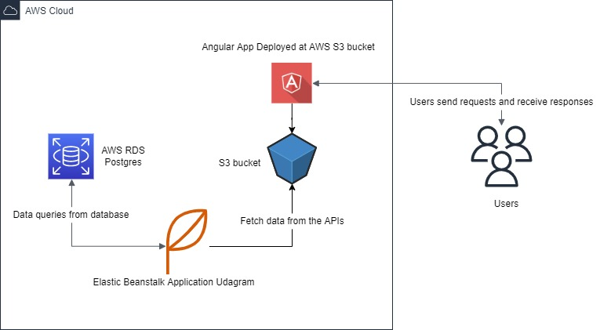

## Udagram Infrastructure

Udagram is deployed on AWS "Amazon Web Service" using multiple services to deploy each part in the app, for the UI we are using S3 Services and for database we are using Postgres RDS and for the API we use the EB.

### AWS

#### Postgres RDS

Udagram is using Postgres RDS as database service in AWS for stroing and fetching our app's data.

DATABASE ARN: `arn:aws:rds:us-east-1:447898413523:db:postgres-1`

#### S3 Bucket

UI application is deployed using AWS S3 Bucket. UI is built by Angular.

BUCKET URL: `http://frontend-bucket-udagram.s3-website-us-east-1.amazonaws.com/home`

#### EB - Elastic Beanstalk

The API server is deployed on AWS Elastic Beanstalk service.

EB URL: `http://udagram-api-dev.eba-bfb3isr3.us-east-1.elasticbeanstalk.com/`
