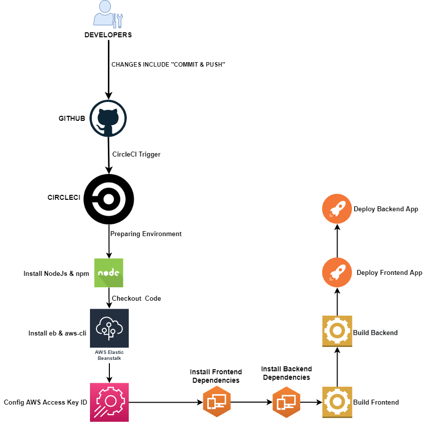

## Pipeline Process CI/CD
### Continuous Integration
#### CircleCI
CircleCI is a CI Tool which is used to tigger the changes to install and build the entire app.
- **Frontend**: CircleCI runs the `install` script to install the UI dependencies then uses `build` script.
- **Backend**: CircleCI runs the `install` script to install the Backend dependencies then uses `build` script, also all environment are imported.

#### Continuous Delievery
In this process we deploy the app after building after checking all changes and get the approval.

